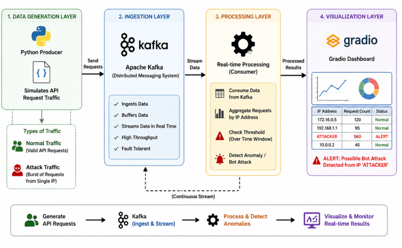
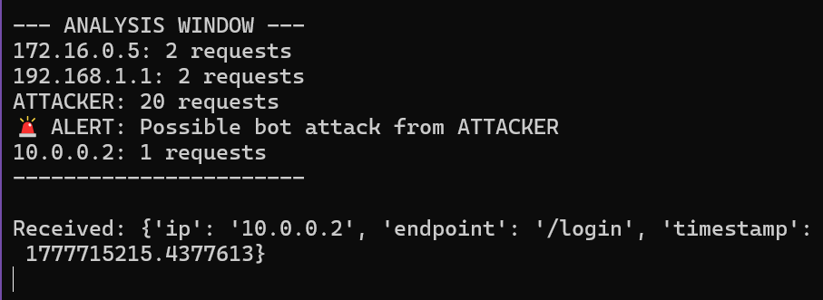

# realtime-api-anomaly-detection

<p align="center">
  <strong>Real-Time API Anomaly & Volumetric Attack Detection Pipeline</strong>
</p>

<p align="center">
  <a href="https://www.python.org/"></a>
  <a href="https://kafka.apache.org/"></a>
  <a href="https://spark.apache.org/"></a>
  <a href="https://www.gradio.app/"></a>
  
</p>

A real-time data streaming pipeline for detecting volumetric bot attacks and API abuse. The system ingests high-throughput HTTP log events through **Apache Kafka**, performs stream processing and sliding-window aggregation using **Python** and **Apache Spark Structured Streaming**, and provides live visual monitoring and instant anomaly alerts via an interactive **Gradio** dashboard.

---

## 📌 Table of Contents

- [Built With](#-built-with)
- [Architecture & Workflow](#-architecture--workflow)
- [Features](#-features)
- [How It Works](#-how-it-works)
- [Anomaly Detection Logic](#-anomaly-detection-logic)
- [Project Structure](#-project-structure)
- [Setup & Prerequisites](#-setup--prerequisites)
- [Execution Steps](#-execution-steps)
- [Expected Output](#-expected-output)
- [Screenshots](#-screenshots)
- [Future Enhancements](#-future-enhancements)
- [Contributors](#-contributors)
- [License](#-license)

---

## 🛠 Built With

* **[Python](https://www.python.org/)** – Traffic simulation, stream processing, windowing logic, and visualization.
* **[Apache Kafka](https://kafka.apache.org/) (v3.7.0)** – Distributed event broker for high-throughput, low-latency log ingestion and streaming.
* **[Apache Spark](https://spark.apache.org/) (v3.5.1)** – PySpark Structured Streaming for scalable schema validation and rolling aggregations.
* **[Gradio](https://www.gradio.app/)** – Interactive web interface for real-time traffic monitoring and attack alerting.
* **[Pandas](https://pandas.pydata.org/)** – In-memory tabular processing and data transformation.
* **[kafka-python](https://github.com/dpkp/kafka-python)** – Kafka client library for producing and consuming JSON log messages.

---

## 🏗 Architecture & Workflow

The architecture follows a decoupled stream-processing design divided into four core layers:

```
                      +------------------------------------------+
                      |         Log Producer (producer.py)       |
                      |  - Legitimate traffic: 1 req/sec         |
                      |  - Volumetric attack: 20-burst (10% prob)|
                      +--------------------+---------------------+
                                           |
                                           | Serialized JSON
                                           v
                      +------------------------------------------+
                      |     Kafka Broker (localhost:9092)        |
                      |            Topic: api_logs               |
                      +---------+----------------------+---------+
                                |                      |
               +----------------+                      +----------------+
               |                                                        |
               v                                                        v
+-------------------------------+                     +---------------------------------+
|   Windowed Python Consumer    |                     |      PySpark Structured Engine  |
|       (consumer.py)           |                     |         (spark_stream.py)       |
|  - 5-second tumbling window   |                     |  - Strict JSON schema parsing   |
|  - In-memory request counter  |                     |  - groupBy("ip").count()        |
|  - Threshold trigger (>15)    |                     |  - Complete output stream sink  |
+---------------+---------------+                     +----------------+----------------+
                |                                                      |
                | Real-Time Alerts                                     | Aggregated Counts
                v                                                      v
      [ Terminal Output ]                                     [ Gradio Dashboard ]
```

<p align="center">
  
</p>

---

## ✨ Features

- **Decoupled Stream Ingestion**: High-performance publish-subscribe architecture with Kafka handling event buffering and decoupling traffic generation from consumer processing.
- **Realistic Traffic & Attack Simulation**: Emits normal client requests at steady intervals while probabilistically injecting burst traffic (20 rapid requests from `ATTACKER`).
- **Tumbling Window Aggregation**: Temporal windowing (5-second intervals) to track request density per client IP address.
- **Distributed Stream Processing**: PySpark Structured Streaming reading directly from Kafka with schema enforcement (`ip`, `endpoint`, `timestamp`) and real-time groupings.
- **Interactive Visual Dashboard**: A clean Gradio web interface providing live traffic statistics and dynamic bot attack alert banners.
- **Modular & Extensible**: Clear separation between data production, stream aggregation, and visualization layers.

---

## 🔍 How It Works

1. **Traffic Generation (`producer.py`)**:
   - Publishes access logs to the `api_logs` Kafka topic on `localhost:9092`.
   - Generates standard API requests targeting the `/login` endpoint from simulated clients (`192.168.1.1`, `10.0.0.2`, `172.16.0.5`) with a 1-second delay.
   - Periodically injects an attack simulation (10% probability per cycle), emitting 20 rapid requests from IP `ATTACKER`.

2. **Windowed Stream Detection (`consumer.py`)**:
   - Consumes messages continuously from `api_logs` and extracts IP address and timestamp fields.
   - Accumulates request counts per IP in an in-memory dictionary.
   - Evaluates counts every 5 seconds. If any IP exceeds the threshold ($> 15$), an attack alert is triggered, and counters reset for the next window.

3. **Distributed Stream Processing (`spark_stream.py`)**:
   - Connects to Kafka via PySpark Structured Streaming.
   - Deserializes binary JSON payloads into structured columns matching `StructType([ip, endpoint, timestamp])`.
   - Performs a stateful count aggregation: `parsed_df.groupBy("ip").count()`.
   - Streams aggregated totals in `complete` mode to console or downstream sinks.

4. **Visual Monitoring (`gradio_app.py`)**:
   - Serves an interactive web application built with Gradio.
   - Displays real-time request counts across all observed IP addresses.
   - Evaluates traffic and displays an instant alert banner when an IP exceeds acceptable limits.

---

## 🎯 Anomaly Detection Logic

The system utilizes **volumetric rate-thresholding** over bounded time intervals:

$$\text{Request Count}(IP)_{\Delta t = 5s} > 15 \implies \text{Raise Attack Alert}$$

* **Normal Baseline**: Legitimate IP addresses generate approximately 1 request per second, yielding $\le 5$ requests per 5-second analysis window.
* **Attack Signature**: When an attack sequence triggers, 20 requests are sent within milliseconds by the `ATTACKER` entity, exceeding the limit by over $33\%$.
* **Alert Outputs**:
  - **Console Output (`consumer.py`)**:
    ```text
    🚨 ALERT: Possible bot attack from ATTACKER
    ```
  - **Web Dashboard (`gradio_app.py`)**:
    ```text
    🚨 ALERT: Possible Bot Attack Detected!
    ```

---

## 📂 Project Structure

```text
realtime-api-anomaly-detection/
├── producer.py                  # Kafka producer simulating normal traffic and attack bursts
├── consumer.py                  # Python consumer with 5-second tumbling window detection logic
├── spark_stream.py              # PySpark Structured Streaming job aggregating requests per IP
├── gradio_app.py                # Gradio interactive web UI for live traffic inspection
├── dashboard.py                 # Streamlit monitoring dashboard script
├── requirements.txt             # Project Python dependencies
├── .gitignore                   # Ignore rules for environments, caches, and big data binaries
├── screenshots/                 # Essential figures and execution screenshots
│   ├── architecture_diagram.png
│   ├── gradio_dashboard.png
│   └── anomaly_detection_alert.png
└── README.md                    # Project documentation
```

---

## 🚀 Setup & Prerequisites

### Prerequisites
* **Operating System**: Linux, macOS, or Windows with WSL
* **Java Development Kit (JDK)**: Java 8, 11, or 17 (required for Kafka and Spark)
* **Python**: Version 3.10 or higher
* **Apache Kafka**: 3.7.x installed locally
* **Apache Spark**: 3.5.x installed locally

### 1. Clone the Repository

```bash
git clone https://github.com/anya2203/Realtime-api-anomaly-detection.git
cd Realtime-api-anomaly-detection
```

### 2. Set Up Virtual Environment

```bash
python3 -m venv venv
source venv/bin/activate
pip install -r requirements.txt
```

---

## 💻 Execution Steps

Run the following commands in separate terminal windows:

### Step 1: Start Apache Kafka

Navigate to your local Kafka installation directory:

```bash
# 1. Start ZooKeeper
bin/zookeeper-server-start.sh config/zookeeper.properties

# 2. Start Kafka Broker
bin/kafka-server-start.sh config/server.properties
```

*(Optional) Create the `api_logs` topic:*
```bash
bin/kafka-topics.sh --create --topic api_logs --bootstrap-server localhost:9092 --partitions 1 --replication-factor 1
```

### Step 2: Start Traffic Simulation

Launch the producer to begin generating real-time log traffic:

```bash
python producer.py
```

### Step 3: Run the Stream Detection Engine

Choose between the Python windowed consumer or PySpark:

**Option A — Python Tumbling Window Consumer:**
```bash
python consumer.py
```

**Option B — PySpark Structured Streaming Engine:**
```bash
spark-submit --packages org.apache.spark:spark-sql-kafka-0-10_2.12:3.5.1 spark_stream.py
```

### Step 4: Launch the Gradio Dashboard

```bash
python gradio_app.py
```
*Access in browser at: `http://127.0.0.1:7860`*

---

## 📋 Expected Output

### Producer Console (`producer.py`)
```text
Sent: {'ip': '192.168.1.1', 'endpoint': '/login', 'timestamp': 1726248102.45}
Sent: {'ip': '10.0.0.2', 'endpoint': '/login', 'timestamp': 1726248103.46}
Sent: {'ip': '172.16.0.5', 'endpoint': '/login', 'timestamp': 1726248104.47}
⚠️ ATTACK SIMULATION
Sent: {'ip': 'ATTACKER', 'endpoint': '/login', 'timestamp': 1726248105.48}
```

### Consumer Analysis Window (`consumer.py`)
```text
Received: {'ip': '192.168.1.1', 'endpoint': '/login', 'timestamp': 1726248102.45}
Received: {'ip': '10.0.0.2', 'endpoint': '/login', 'timestamp': 1726248103.46}

--- ANALYSIS WINDOW ---
192.168.1.1: 3 requests
10.0.0.2: 2 requests
172.16.0.5: 2 requests
ATTACKER: 20 requests
🚨 ALERT: Possible bot attack from ATTACKER
-----------------------
```

### Spark Structured Streaming (`spark_stream.py`)
```text
-------------------------------------------
Batch: 1
-------------------------------------------
+-----------+-----+
|         ip|count|
+-----------+-----+
|  10.0.0.2|    2|
|192.168.1.1|    3|
| 172.16.0.5|    2|
|   ATTACKER|   20|
+-----------+-----+
```

---

## 📸 Screenshots

### 1. Gradio Live Attack Detection Dashboard
Live tabular view of IP request counts with an instant alert banner triggered upon detecting a bot attack:
<p align="center">
  
</p>

---

### 2. Real-Time Terminal Detection Window
The tumbling window evaluates request rates every 5 seconds, flagging the attack spike from `ATTACKER`:
<p align="center">
  
</p>

---

## 🔮 Future Enhancements

- **Unsupervised Machine Learning**: Integrate Isolation Forest or Autoencoders into the streaming pipeline to detect behavioral anomalies beyond simple request volume.
- **Event-Time Watermarking**: Implement Spark event-time watermarking to gracefully handle late-arriving logs and out-of-order events.
- **Automated Mitigation Actions**: Hook detection triggers directly into network-level mitigation tools (e.g., automated firewall rules or API Gateway rate-limiters).
- **Multi-Dimension Metrics**: Broaden inspection to include HTTP status codes (e.g., 401/403 brute-force spikes), request payload sizes, and geographic distribution.
- **Containerized Orchestration**: Add Docker Compose configurations for one-click setup of Kafka, ZooKeeper, Spark, and dashboards.

---

## 👥 Contributors

* **Ananya Manoharan** (1BM23AI020)
* **Divyam Jain** (1BM23AI063)
* **Goutham T G** (1BMAI23070)

**Faculty In-charge:** Dr. Vinutha H  
*Department of Machine Learning, B.M.S. College of Engineering, Bengaluru*

---

## 📄 License

This project is open-source and available under the [MIT License](LICENSE).
