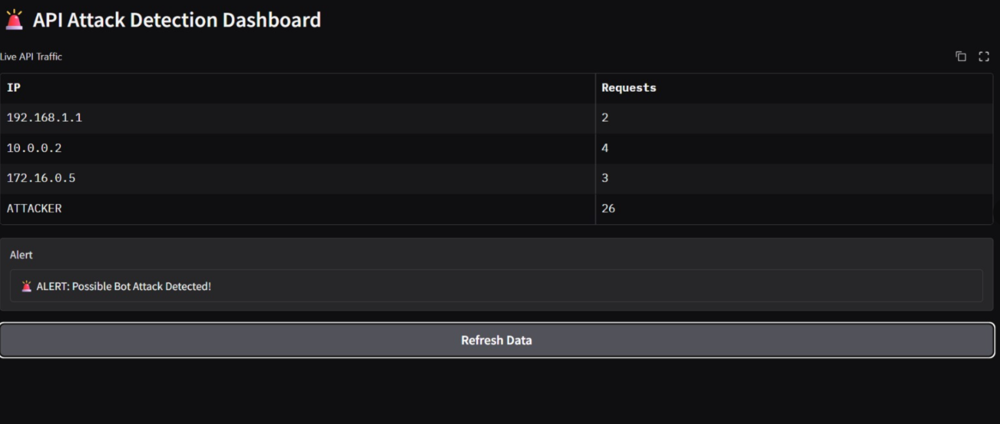

# Realtime-api-anomaly-detection

<p align="center">
  <strong>Real-Time API Anomaly & Volumetric Attack Detection Pipeline</strong>
</p>

<p align="center">
  <a href="https://www.python.org/"></a>
  <a href="https://kafka.apache.org/"></a>
  <a href="https://spark.apache.org/"></a>
  <a href="https://www.gradio.app/"></a>
  <a href="https://streamlit.io/"></a>
  
</p>

A real-time data streaming pipeline for detecting volumetric bot attacks and API anomalies. The system ingests high-throughput HTTP log events through **Apache Kafka**, performs distributed stream aggregations using **Apache Spark Structured Streaming** and sliding-window Python consumers, and provides instant visual alerting through **Gradio** and **Streamlit** dashboards.

---

## Table of Contents

- [Built With](#-built-with)
- [Architecture & Workflow](#-architecture--workflow)
- [Features](#-features)
- [How It Works](#-how-it-works)
- [Anomaly Detection Logic](#-anomaly-detection-logic)
- [Project Structure](#-project-structure)
- [Setup & Prerequisites](#-setup--prerequisites)
- [Execution Steps](#-execution-steps)
- [Expected Output](#-expected-output)
- [Screenshots](#-screenshots)
- [Future Enhancements](#-future-enhancements)
- [Contributors](#-contributors)
- [License](#-license)

---

## Built With

* **[Python](https://www.python.org/)** – Pipeline implementation, stream processing logic, and interface definitions.
* **[Apache Kafka](https://kafka.apache.org/) (v3.7.0)** – Distributed message broker for high-throughput, low-latency log ingestion.
* **[Apache Spark](https://spark.apache.org/) (v3.5.1)** – PySpark Structured Streaming for scalable schema validation and rolling aggregations.
* **[Gradio](https://www.gradio.app/)** – Interactive web interface for on-demand traffic inspection and alert verification.
* **[Streamlit](https://streamlit.io/)** – Live operations dashboard for continuous monitoring of output streams.
* **[Pandas](https://pandas.pydata.org/)** – In-memory tabular parsing and data transformation.
* **[kafka-python](https://github.com/dpkp/kafka-python)** – Kafka client library for producing and consuming JSON log messages.

---

## Architecture & Workflow

The architecture follows a decoupled stream-processing design separated into four primary layers:

```
                      +------------------------------------------+
                      |         Log Producer (producer.py)       |
                      |  - Legitimate traffic: 1 req/sec         |
                      |  - Volumetric attack: 20-burst (10% prob)|
                      +--------------------+---------------------+
                                           |
                                           | Serialized JSON
                                           v
                      +------------------------------------------+
                      |     Kafka Broker (localhost:9092)        |
                      |            Topic: api_logs               |
                      +---------+----------------------+---------+
                                |                      |
               +----------------+                      +----------------+
               |                                                        |
               v                                                        v
+-------------------------------+                     +---------------------------------+
|   Windowed Python Consumer    |                     |      PySpark Structured Engine  |
|       (consumer.py)           |                     |         (spark_stream.py)       |
|  - 5-second tumbling window   |                     |  - Strict JSON schema parsing   |
|  - In-memory request counter  |                     |  - groupBy("ip").count()        |
|  - Threshold trigger (>15)    |                     |  - Complete output stream sink  |
+---------------+---------------+                     +----------------+----------------+
                |                                                      |
                | Console Alerts                                       | Aggregated Metrics
                v                                                      v
      [ Terminal Output ]                             +---------------------------------+
                                                      |      Visual Monitoring UIs      |
                                                      |  - dashboard.py (Streamlit)     |
                                                      |  - gradio_app.py (Gradio UI)    |
                                                      +---------------------------------+
```

---

## Features

- **Decoupled Stream Ingestion**: Reliable publish-subscribe architecture with Kafka handling event buffering and decoupling producers from consumer applications.
- **Realistic Attack Simulation**: Emits normal client requests at steady intervals while probabilistically injecting burst traffic (20 rapid requests from `ATTACKER`).
- **Tumbling Window Aggregation**: In-memory temporal windowing (5-second intervals) to track request density per client IP.
- **Distributed Stream Processing**: PySpark Structured Streaming reading from Kafka with schema enforcement (`ip`, `endpoint`, `timestamp`) and real-time groupings.
- **Dual Visual Monitoring Solutions**:
  - **Streamlit**: Automated file polling and table updates with high-visibility attack alert banners.
  - **Gradio**: Clean, browser-based UI allowing manual refresh of traffic metrics and alert checks.
- **Lightweight & Modular**: Clean separation between data production, stream aggregation, and visualization layers.

---

## How It Works

1. **Traffic Generation (`producer.py`)**:
   - Publishes access logs to the `api_logs` Kafka topic on `localhost:9092`.
   - Generates standard API requests targeting the `/login` endpoint from simulated clients (`192.168.1.1`, `10.0.0.2`, `172.16.0.5`) with a 1-second delay.
   - Triggers an attack burst with a 10% chance per cycle, generating 20 immediate requests from IP `ATTACKER`.

2. **Windowed Stream Detection (`consumer.py`)**:
   - Consumes messages continuously from `api_logs`.
   - Tracks request frequencies per client IP using an in-memory counter.
   - Evaluates accumulated counts every 5 seconds. If any IP exceeds the threshold, an attack alert is triggered, and counters reset for the next window.

3. **Distributed Stream Aggregation (`spark_stream.py`)**:
   - Connects to Kafka via PySpark Structured Streaming.
   - Decodes the raw binary payload into a string and parses it into structured columns matching `StructType([ip, endpoint, timestamp])`.
   - Performs a stateful count aggregation: `parsed_df.groupBy("ip").count()`.
   - Streams aggregated totals in `complete` mode to the console sink or downstream files.

4. **Visual Monitoring Dashboards**:
   - **Streamlit (`dashboard.py`)**: Continuously monitors `/tmp/output` every 2 seconds, reads the latest CSV batch, and renders a live table with a red alert banner if an attack is detected.
   - **Gradio (`gradio_app.py`)**: Serves an interactive dashboard featuring a "Refresh Data" action, displaying traffic distributions and alert status.

---

##  Anomaly Detection Logic

The system utilizes **volumetric rate-thresholding** over bounded time intervals:

$$\text{Request Count}(IP)_{\Delta t = 5s} > 15 \implies \text{Raise Attack Alert}$$

* **Normal Baseline**: Legitimate IP addresses generate 1 request per second, yielding $\le 5$ requests per 5-second window.
* **Attack Signature**: When the attack sequence triggers, 20 requests are sent instantaneously by the `ATTACKER` entity, exceeding the limit by $33\%+$.
* **Alert Trigger**:
  - **`consumer.py`**: When `count > 15`, prints:
    ```text
    🚨 ALERT: Possible bot attack from ATTACKER
    ```
  - **`dashboard.py`**: When `df["Requests"].max() > 15`, displays:
    ```text
    🚨 ALERT: Bot Attack Detected!
    ```
  - **`gradio_app.py`**: When `df["Requests"].max() > 15`, displays:
    ```text
    🚨 ALERT: Possible Bot Attack Detected!
    ```

---

##  Project Structure

```text
realtime-api-anomaly-detection/
├── producer.py          # Kafka producer simulating normal traffic and attack bursts
├── consumer.py          # Python consumer with a 5-second tumbling window detection logic
├── spark_stream.py      # PySpark Structured Streaming script aggregating requests per IP
├── dashboard.py         # Streamlit real-time monitoring dashboard with visual alerts
├── gradio_app.py        # Gradio interactive web UI for traffic inspection
├── requirements.txt     # Python dependencies
├── .gitignore           # Ignore rules for environments, caches, and big data binaries
├── screenshots/         # Directory for interface screenshots
│   └── .gitkeep
└── README.md            # Comprehensive project documentation
```

---

##  Setup & Prerequisites

### Prerequisites
* **Operating System**: Linux, macOS, or Windows with WSL
* **Java Development Kit (JDK)**: Java 8, 11, or 17 (required for Kafka and Spark)
* **Python**: Version 3.10 or higher
* **Apache Kafka**: 3.7.x installed locally
* **Apache Spark**: 3.5.x installed locally

### 1. Clone the Repository

```bash
git clone https://github.com/anya2203/realtime-api-anomaly-detection.git
cd realtime-api-anomaly-detection
```

### 2. Set Up Virtual Environment

```bash
python3 -m venv venv
source venv/bin/activate
pip install -r requirements.txt
```

---

##  Execution Steps

Run the following commands in separate terminal windows:

### Step 1: Start Apache Kafka

Navigate to your local Kafka installation directory:

```bash
# 1. Start ZooKeeper
bin/zookeeper-server-start.sh config/zookeeper.properties

# 2. Start Kafka Broker
bin/kafka-server-start.sh config/server.properties
```

*(Optional) Verify or create the `api_logs` topic:*
```bash
bin/kafka-topics.sh --create --topic api_logs --bootstrap-server localhost:9092 --partitions 1 --replication-factor 1
```

### Step 2: Start Traffic Simulation

Launch the producer to begin generating real-time API logs:

```bash
python producer.py
```

### Step 3: Run the Stream Detection Engine

Choose between the Python windowed consumer or PySpark:

**Option A — Python Tumbling Window Consumer:**
```bash
python consumer.py
```

**Option B — PySpark Structured Streaming Engine:**
```bash
spark-submit --packages org.apache.spark:spark-sql-kafka-0-10_2.12:3.5.1 spark_stream.py
```
*(Or execute directly via `python spark_stream.py` if Spark environment variables are configured).*

### Step 4: Run the Visual Dashboards

**Launch Streamlit Real-Time Dashboard:**
```bash
streamlit run dashboard.py
```
*Accessible at: `http://localhost:8501`*

**Launch Gradio Interactive App:**
```bash
python gradio_app.py
```
*Accessible at: `http://127.0.0.1:7860`*

---

##  Expected Output

### Producer Console (`producer.py`)
```text
Sent: {'ip': '192.168.1.1', 'endpoint': '/login', 'timestamp': 1726248102.45}
Sent: {'ip': '10.0.0.2', 'endpoint': '/login', 'timestamp': 1726248103.46}
Sent: {'ip': '172.16.0.5', 'endpoint': '/login', 'timestamp': 1726248104.47}
⚠️ ATTACK SIMULATION
Sent: {'ip': 'ATTACKER', 'endpoint': '/login', 'timestamp': 1726248105.48}
```

### Consumer Analysis Window (`consumer.py`)
```text
Received: {'ip': '192.168.1.1', 'endpoint': '/login', 'timestamp': 1726248102.45}
Received: {'ip': '10.0.0.2', 'endpoint': '/login', 'timestamp': 1726248103.46}

--- ANALYSIS WINDOW ---
192.168.1.1: 3 requests
10.0.0.2: 2 requests
172.16.0.5: 2 requests
ATTACKER: 20 requests
🚨 ALERT: Possible bot attack from ATTACKER
-----------------------
```

### Spark Structured Streaming (`spark_stream.py`)
```text
-------------------------------------------
Batch: 1
-------------------------------------------
+-----------+-----+
|         ip|count|
+-----------+-----+
|  10.0.0.2|    2|
|192.168.1.1|    3|
| 172.16.0.5|    2|
|   ATTACKER|   20|
+-----------+-----+
```

---

## Screenshots

> Place your screenshot images in the `screenshots/` directory to display them here.

### 1. Streamlit Live Monitoring Dashboard
```
+-------------------------------------------------------------------------+
|                    [ Streamlit Dashboard Preview ]                      |
|             Save image to: screenshots/streamlit_dashboard.png          |
+-------------------------------------------------------------------------+
```
<p align="center">
  
</p>

*Displays live tabular traffic distributions and triggers a red alert banner upon detecting requests exceeding the threshold.*

---

### 2. Gradio Interactive Interface
```
+-------------------------------------------------------------------------+
|                      [ Gradio Interface Preview ]                       |
|               Save image to: screenshots/gradio_dashboard.png           |
+-------------------------------------------------------------------------+
```
<p align="center">
  
</p>

*Interactive browser UI providing on-demand traffic inspection with a "Refresh Data" action and alert textbox.*

---

### 3. Terminal Anomaly Detection
```
+-------------------------------------------------------------------------+
|                      [ Terminal Output Preview ]                        |
|              Save image to: screenshots/terminal_detection.png          |
+-------------------------------------------------------------------------+
```
<p align="center">
  
</p>

*Live stdout logs from the Python window consumer displaying tumbling window evaluations and bot attack alerts.*

---

## Future Enhancements

- **Unsupervised Machine Learning**: Integrate Isolation Forest or Autoencoders in PySpark to catch subtle non-volumetric anomaly patterns.
- **Event-Time Watermarking**: Implement Spark event-time watermarking to handle out-of-order logs and network delays cleanly.
- **Automated Mitigation Actions**: Connect alert triggers directly to Cloud WAF or local firewall rules (`iptables`) for automated IP blocking.
- **Multi-Dimension Metrics**: Track anomalous spikes across HTTP status codes (e.g., 401/403 brute-force storms) and request payload sizes.
- **Containerized Orchestration**: Add a Docker Compose configuration for one-command spin-up of Kafka, Zookeeper, Spark, and dashboards.

---

## Contributors

- **Ananya** – *Project Author & Pipeline Developer*

---

## License

This project is licensed under the [MIT License](LICENSE) – feel free to use and adapt this project for educational and research purposes.
